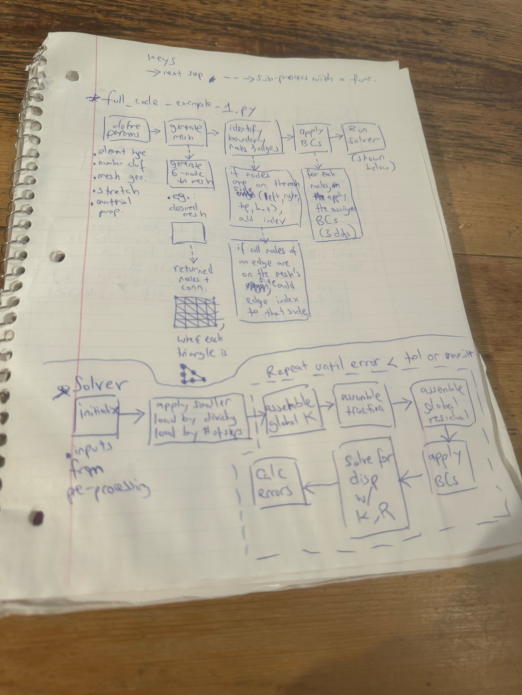
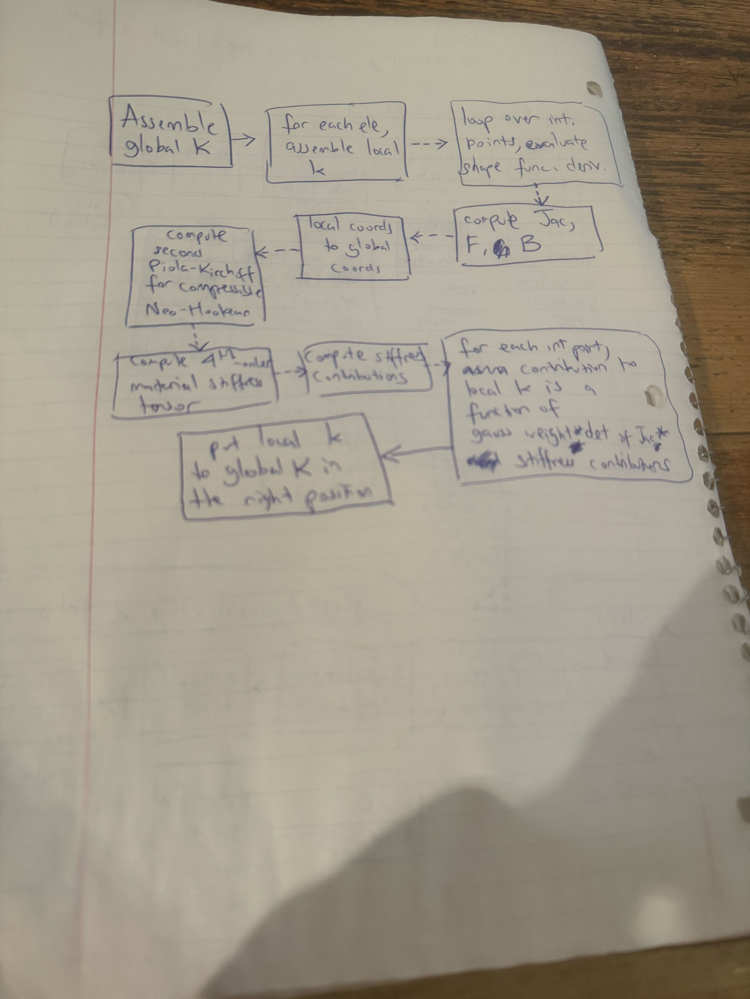

# Finite Element Analysis

For part 4 tutorials, please look at ``tutorials/a4p4.ipynb``. All the codes are ran and the results are displayed already, so you won't have to re-run it if you don't want to.

# Finite Element Analysis code flow

